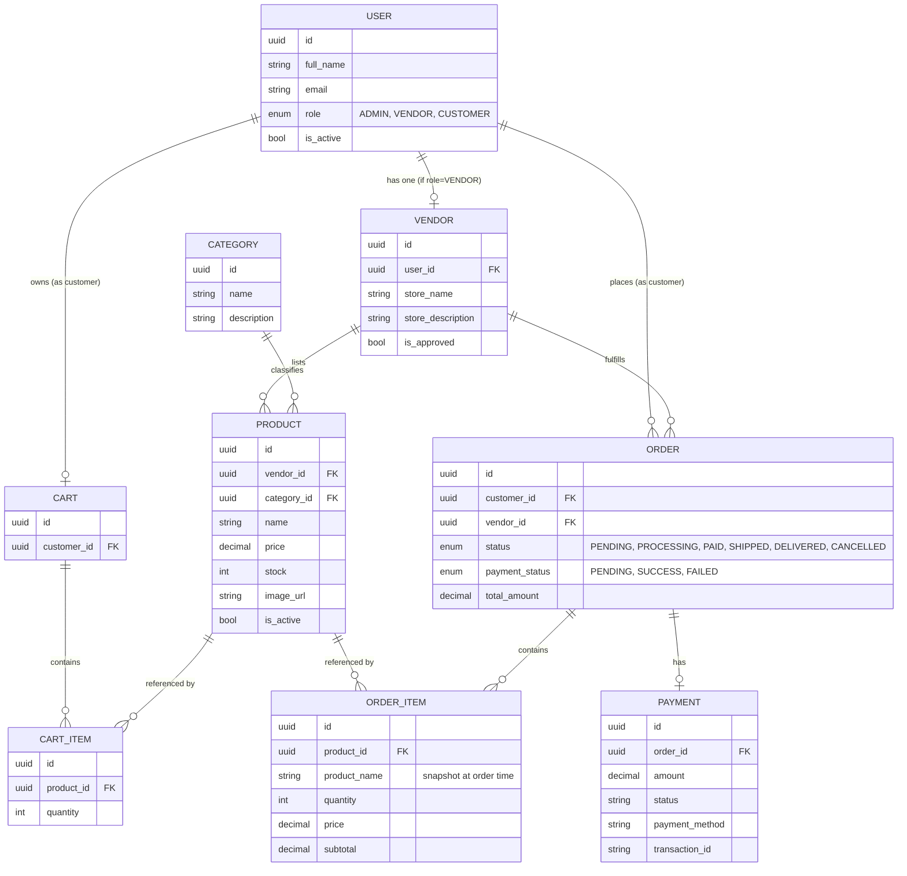
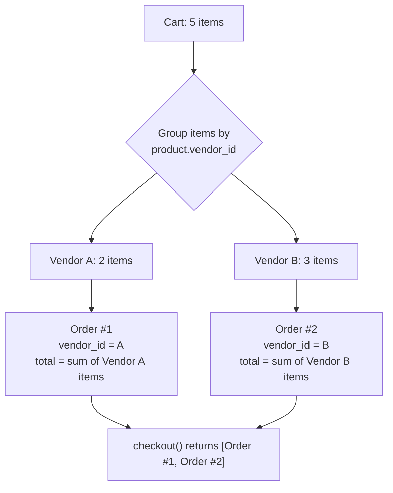

# Frontend — Multi-Vendor E-commerce

React + TypeScript + Vite frontend for the multi-vendor e-commerce backend (FastAPI + PostgreSQL). Built against the real backend contract — see `app/schemas/`, `app/routers/`, `app/constants/enums.py` in the backend repo as the source of truth.

---

## 1. Setup instructions

### Prerequisites
- Node.js 18+
- The backend running locally (default: `http://localhost:8000`) with CORS enabled for your dev server origin

### Install
```bash
npm create vite@latest ecommerce-frontend -- --template react-ts
cd ecommerce-frontend

npm install react-router-dom axios zustand @tanstack/react-query
npm install react-hook-form zod @hookform/resolvers
npm install -D tailwindcss @tailwindcss/vite
```

### Configure Tailwind v4
**`vite.config.ts`**
```ts
import { defineConfig } from 'vite'
import react from '@vitejs/plugin-react'
import tailwindcss from '@tailwindcss/vite'

export default defineConfig({
  plugins: [react(), tailwindcss()],
})
```

### Environment
Copy `.env.example` → `.env`:
```
VITE_API_BASE_URL=http://localhost:8000
```
No `/api` prefix — this backend's routers mount at root (`/auth`, `/products`, etc., not `/api/v1/...`).

### Run
```bash
npm run dev
```

### Backend requirement
The backend must have CORS enabled or every request will be blocked by the browser:
```python
from fastapi.middleware.cors import CORSMiddleware

app.add_middleware(
    CORSMiddleware,
    allow_origins=["http://localhost:5173"],
    allow_credentials=True,
    allow_methods=["*"],
    allow_headers=["*"],
)
```

---

## 2. API endpoints

Everything below is what the frontend actually calls (see `src/api/*.ts`), grouped by resource. Auth column shows the role dependency enforced by the backend.

### Auth (`src/api/auth.ts`)
| Method | Path | Auth | Notes |
|---|---|---|---|
| POST | `/auth/register` | Public | Creates a user, does **not** log in |
| POST | `/auth/login` | Public | `application/x-www-form-urlencoded`, fields `username`/`password` (OAuth2PasswordRequestForm) |
| GET | `/auth/me` | Any authenticated | No update endpoint exists — profile is read-only |

### Users (`src/api/users.ts`)
| Method | Path | Auth | Notes |
|---|---|---|---|
| POST | `/users` | Admin | Create user directly (any role) |
| GET | `/users` | Admin | List all |
| GET | `/users/{id}` | Admin | |
| PUT | `/users/{id}` | Admin | `full_name`/`email`/`role` only — no `is_active`, can't deactivate |
| DELETE | `/users/{id}` | Admin | 204 |

### Vendors (`src/api/vendors.ts`)
| Method | Path | Auth | Notes |
|---|---|---|---|
| POST | `/vendors` | Vendor | Creates the vendor's own store |
| GET | `/vendors/me` | Vendor | 404 if store not created yet |
| PUT | `/vendors/me` | Vendor | |
| GET | `/vendors` | Admin | List all, for approval queue |
| PATCH | `/vendors/{id}/approve` | Admin | |

### Categories (`src/api/categories.ts`)
| Method | Path | Auth | Notes |
|---|---|---|---|
| POST | `/categories` | Admin | |
| GET | `/categories` | Public | |
| GET | `/categories/{id}` | Public | |
| PUT | `/categories/{id}` | Admin | |
| DELETE | `/categories/{id}` | Admin | |

### Products (`src/api/products.ts`)
| Method | Path | Auth | Notes |
|---|---|---|---|
| POST | `/products` | Vendor | |
| GET | `/products` | Public | No pagination/search/filter params — frontend fetches all and filters client-side |
| GET | `/products/me` | Vendor | Vendor's own listings |
| GET | `/products/{id}` | Public | |
| PUT | `/products/{id}` | Vendor | |
| POST | `/products/{id}/image` | Vendor | `multipart/form-data`, field name `image` |
| DELETE | `/products/{id}` | Vendor | |

### Cart (`src/api/cart.ts`)
| Method | Path | Auth | Notes |
|---|---|---|---|
| POST | `/cart/items` | Customer | |
| GET | `/cart` | Customer | |
| PUT | `/cart/items/{id}` | Customer | |
| DELETE | `/cart/items/{id}` | Customer | |
| DELETE | `/cart/clear` | Customer | |

### Orders (`src/api/orders.ts`)
| Method | Path | Auth | Notes |
|---|---|---|---|
| POST | `/orders/checkout` | Customer | Returns `OrderResponse[]` — see splitting logic below |
| GET | `/orders/my-orders` | Customer | |
| GET | `/orders/vendor-orders` | Vendor | |
| GET | `/orders` | Admin | Platform-wide |
| GET | `/orders/{id}` | Any authenticated | |
| PUT | `/orders/{id}/status` | Vendor | Body: `{ status: OrderStatus }` |
| PUT | `/orders/{id}/cancel` | Customer | No body |

### Payments (`src/api/payments.ts`)
| Method | Path | Auth | Notes |
|---|---|---|---|
| POST | `/payments/orders/{order_id}` | Customer | Body: `{ payment_method: string }` |
| PUT | `/payments/{id}` | Customer | Body: `{ status, transaction_id? }` |
| GET | `/payments/my-payments` | Customer | |
| GET | `/payments/{id}` | Customer | |
| GET | `/payments` | Admin | |

---

## 3. Database schema (as consumed by the frontend)

**Caveat:** this is reconstructed from the Pydantic response/request schemas and the IDs they expose (`vendor_id`, `category_id`, etc.), not from reading `app/models/*.py` directly. It should match, but the SQLAlchemy models are the actual source of truth if anything here looks off.



Key relationships that shape the frontend:
- **`ORDER.vendor_id` is a single value, not a list** — one order always belongs to exactly one vendor. This is the reason checkout splits a multi-vendor cart into multiple orders (see below).
- **`ORDER_ITEM.product_name` is a snapshot**, not a live reference — order history stays accurate even if a vendor later renames or deletes the product.
- **No address entity exists anywhere.** Checkout in this frontend collects an address for UX purposes only, but has nowhere on the backend to persist it.

---

## 4. Order-splitting logic

The cart is a single flat list of items that can come from **any vendor** — nothing stops a customer from adding products from three different stores to one cart. But `Order` has exactly one `vendor_id`. The backend reconciles this at checkout time: `POST /orders/checkout` groups the cart's items by their product's vendor, and creates one separate `Order` (with its own `OrderItem`s and `total_amount`) per vendor group — which is why the endpoint returns `OrderResponse[]`, not a single `OrderResponse`.



**What this means for the frontend:**
- `CheckoutPage.tsx` calls `checkout()` once, gets back an array, and loops over it to create one payment per order (`createPayment(order.id, ...)` for each) — a single cart checkout can create multiple payments.
- `CheckoutSuccessPage.tsx` checks the array length and tells the customer explicitly when their order was split ("split into N orders") so it isn't confusing when their order history shows multiple entries for one checkout.
- Order status, cancellation, and vendor fulfillment (`PUT /orders/{id}/status`, `PUT /orders/{id}/cancel`) all operate **per split order**, not per original cart — a customer could, for example, cancel the order going to Vendor A while Vendor B's order ships normally.
- `BuyerOrdersPage.tsx` and `AdminOrdersPage.tsx` list these as independent orders; there's currently no UI grouping that reconstructs "these N orders came from one checkout session" after the fact, since the backend doesn't return a shared checkout/session ID linking them.

---

## 5. What's built

- **Auth** — login, register (customer/vendor only; admin isn't self-registrable)
- **Storefront** — product grid with client-side search/filter/sort, product detail, add-to-cart
- **Cart + checkout** — full flow through order confirmation (address is UI-only, see schema notes above)
- **Buyer dashboard** — orders (with cancel), payments, read-only profile
- **Vendor dashboard** — store setup/approval flow, products (CRUD + image upload), orders (status updates), store settings
- **Admin dashboard** — vendor approvals, category CRUD, all payments, all orders (read-only, names resolved), full user CRUD

## 6. Known gaps (frontend can't fix these — they're backend-side)
- No `is_active` field on `UserUpdate` — can't deactivate a user, only delete
- No address field anywhere in the schema — checkout address is cosmetic
- No vendor order fulfillment beyond status (no shipping/tracking numbers, no returns/refunds)
- `GET /products` has no pagination/search/filter — fine for a small catalog, won't scale

## 7. Known gaps (frontend-only, no backend blocker — just not built yet)
- Dashboard sidebars aren't responsive on mobile (no collapse/hamburger)
- No 404 page — unknown routes silently redirect to `/`
- No global error boundary
- No centralized toast system — every action shows its own inline message
